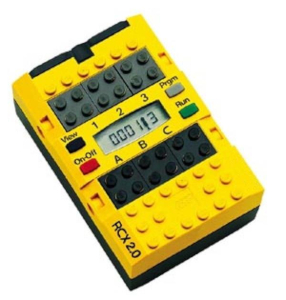
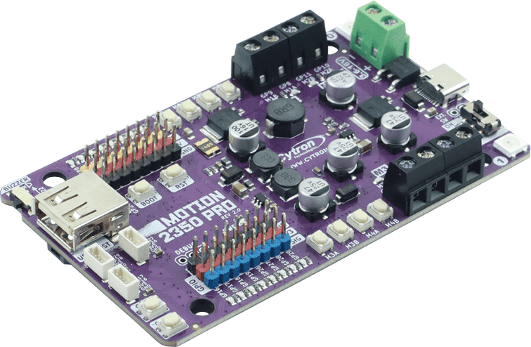
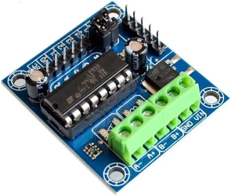
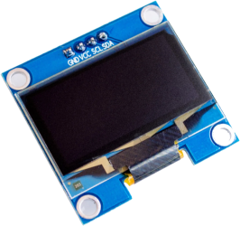
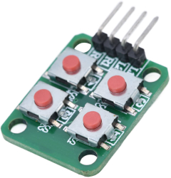
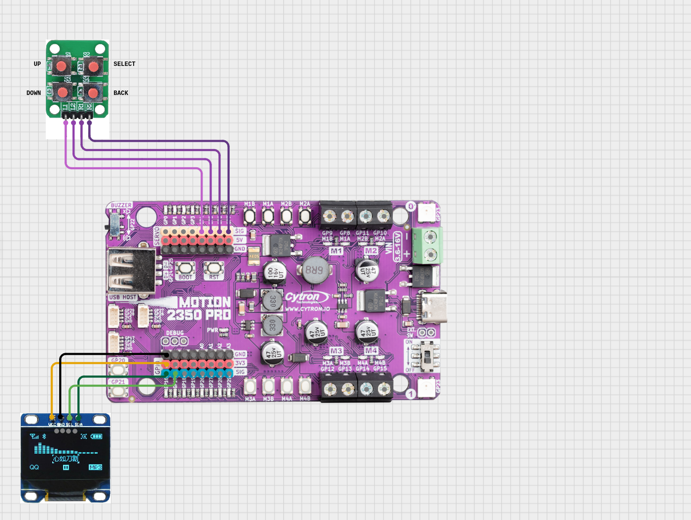
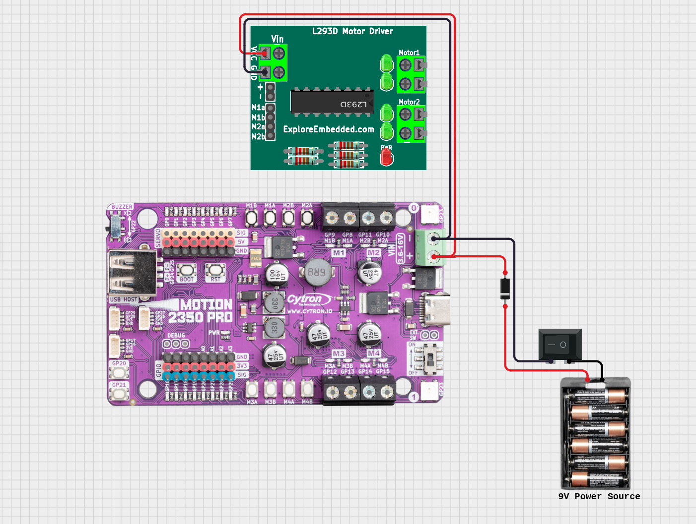
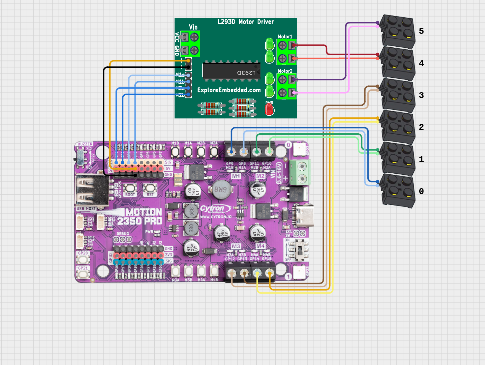
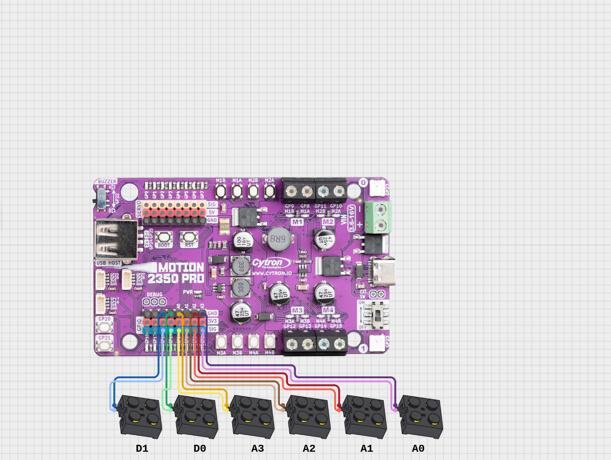
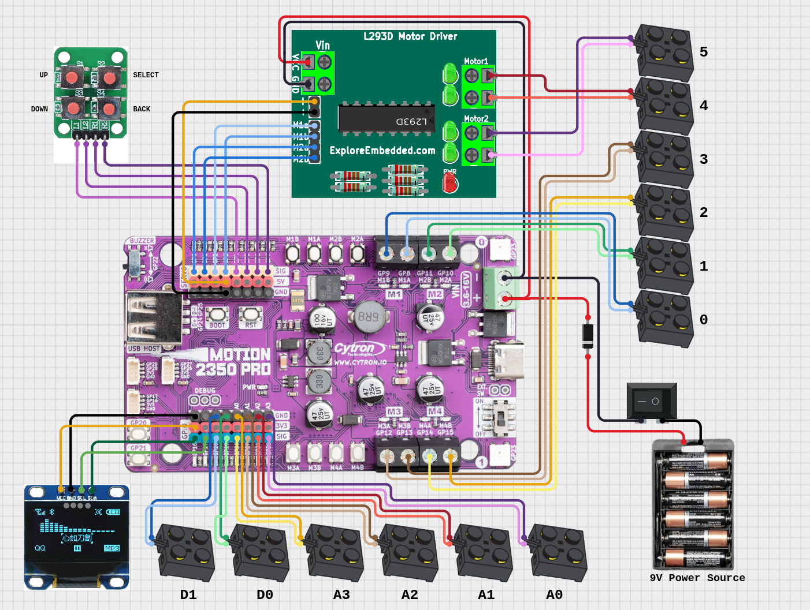

# Super RCX
The Super RCX is an attempt to recreate the functionality of the Lego Mindstorms Robotic Command eXplorer (RCX) brick using a modern single-board computer.  
  
The RCX was originally released all the way back in 1998. As such, it is extremely limited, both in terms of functionality and compatibility with modern computer systems, especially compared to later generations of Lego Mindstorms. The goal of this project is to create a drop-in replacement for the RCX that improves upon the functionality of the original, while retaining full compatibility with the original motors and sensors.

Please note that this project is currently in beta. The software does not yet support RCX temperature or rotation sensors, and is missing some minor functionality.

## Hardware
The Super RCX hardware is assembled from low cost off-the-shelf electronic components. Some prior experience with electronics and soldering is strongly recommended for anyone wishing to build a Super RCX hub. Unfortunately, it is not possible to purchase a pre-assembled hub at this time.

The Super RCX hub is designed around the Cytron Motion 2350 Pro. This is an entry-level robotics controller that was chosen due to it's combination of low cost, modern architecture, small size, and feature-rich design.

  

### Bill Of Materials

* Cytron Motion 2350 Pro
* 2-channel L293D based DC motor controller
* SSD1306 OLED display
* 2x2 matrix keypad
* 12 Lego 9-volt connector plates
* 1n4148 diode
* 9-volt DC power supply
* 2 - 6 inch Female-to-Female jumper wires

  
  
These components generally cost between 40 and 60 USD in total, though prices may vary depending on region, purchase location, and shipping fees.

The DC motor controller is technically optional, although you will be limited to four motor outputs rather than six.

Just about any battery pack or wall adapter that produces 9 volts DC can be used to power the Super RCX hub.

#### You may also need:
* Additional spare wire
* Heat shrink tubing
* Soldering equipment
* Hot glue
* Extra materials for a hub enclosure

### Assembly
#### Wiring
The components should be wired together according to the provided schematics. It is important to make sure that all the GPIO connections are correct, or else certain components may not work.  


The display can optionally be connected to the Maker port directly above the GPIO buttons, rather than the shown pins.


The power terminal of the DC motor controller should be connected in paralell with that of the Motion 2350 Pro.  
Note the diode on the power input line.




It is recommended that you solder female jumper leads to the Lego 9-volt pads, in order to connect them to the sensor pins.


Complete wiring diagram.

#### Housing
I have not provided specific instructions for the physical assembly of the hub, as the design I'm using is a bit rough and is held together largely by hot glue. I have provided some photos for reference, however an alternate design or 3D printed housing may be more ideal.


Note that the BOOT SELECT button is not accessible when the hub is assembled. I have added a lever to the rear of this design that allows it to be pressed.

## Software
The Super RCX software is built with [MicroPython](https://docs.micropython.org/en/latest/index.html). MicroPython does not officially support The Cytron 2350 Pro, so I have created a custom board definition for it.

### Installation
1) Download the latest version of `micropython.uf2` form the Releases section of this repository.  
2) Connect the Motion 2350 Pro to your computer and power it on while holding the BOOT button.
3) Copy `micropython.uf2` to the USB mass storage device that appears.
4) Wait for the file to copy and the board to reset. A new 1MB USB drive should appear when the installation is finished.
5) Download `firmwre.zip` from the Releases section of this repository. You can also download the sample programs if desired.
6) Extract the contests of `firmware.zip` to the root of the 1MB USB drive. Do the same for `sample_porgrams.zip` if desired.
7) Safely remove the Motion 2350 Pro from your computer and reboot it. The Super RCX menu should appear on the display.

## Programming
Super RCX programs are written in Python and are stored on the Motion 2350 Pro's 1MB internal storage. On boot, all *.py* files in the root directory (other than *main.py*) are enumerated and added to the `Programs` list. 

Programs can be written with any standard text editor, no special software required. However, a development-orientated text editor that supports syntax highlighting is strongly recommended. While not strictly necessary, a Python serial debugger can be used with the Motion 2350 Pro, and is very useful for developing larger or more complex programs.

Nearly all of MicroPython's classes, libraries, and methods can be used when writing programs, in addition to the custom methods documented here.

### Program Structure
All programs must have a function called `main()`. This is the first thing that runs when a program starts, and a program cannot start without it. Additionally, a program cannot interface with any component of the robot's hardware until it has been imported form the `robot` library. These are discussed in more detail in the Classes section.

An example of a bare-bones program is shown below.  
```
from robot import led

def main():
	led.setColor(0, "Red")
	while True:
		pass
```
This program will enable the first on-board LED (`LED0`) and set it's color to red, then remains idle until it is closed.

Other functions can be created outside of `main()`, but they must be called from within `main()` in order to run.
```
from robot import led

def main():
	lightUp()
	while True:
		pass

def lightUp():
	led.setColor(0, "Red")
```
This program behaves the same as the previous example.

### Classes
The Super RCX software contains a number of custom classes that are used to control it's hardware. These classes are all imported from `robot` and are explained in detail in this section.

### Class `motor`
This class is used for controlling motors connected to output ports 0 though 5.
#### Methods:
`motor.run(*port*, *speed*)`   
Runs the motor on the specified output port at the given speed. 100 is full speed in the forward direction, -100 is full speed reverse.  
Example:
```
motor.run(0, 100) 	#run the motor on port 0 forward at full speed
motor.run(2, -50) 	#run the motor on port 2 backward at 50% speed
```
</br>

`motor.stop(*port*)`
Stops the motor on the specified port if it is currently running.  
Example:
```
motor.stop(0)	#stop the motor on port 0
```
</br>

`motor.setDirection(*port*, *direction*)`  
Sets which direction the specified motor treats as forward. "Forward" is the default. Setting "Reverse" will cause negative speed values to run the motor forwards, and vice-versa.  
Example:
```
motor.run(1, 100) 					#run the motor forwards at full speed
motor.stop(1)						#stop the motor
motor.setDirection(1, "Reverse")	#reverse the motor's direction
motor.run(1, 100)					#run the motor backwards at full speed

```
</br>

`motor.getSpeed(*port*)`  
Returns the current speed of the specified motor as an integer.  
Note that this returns the actual speed of the motor as reported by the PWM controller, rather than the target speed specified by the `run` command.  
Example:
```
motor.run(0, 75)			#run the motor forward at 75% speed
print(motor.getSpeed(0)) 	#print '75' to the debug log
```
</br>

`motor.getDirection(*port*)`  
Returns the given motor's current direction as a string. Note that this is the direction specified by `motor.setDirection()`, not the motor's current rotational direction.  
Example:
```
print(motor.getDirection(2)) 		#print "Forward" to the debug log
motor.setDirection(2, "Reverse")	#set the motor direction to reverse
print(motor.getDirection(2)) 		#print "Reverse" to the debug log
```
</br>

`motor.setDriveMotors(*left motor*, *right motor*)`  
Assigns two motors to use as the left and right drive motors of a differential steering system. This command must be run before any methods in the `drive` class can be used.  
Example:
```
motor.setDriveMotors(0, 1) 	#sets motors 0 and 1 to act as the left and right drive motors.
```
</br>

Complete example program using motors:  
````
import time
from robot import motor

def main():

	#run motors 0 and 1 forward for 10 seconds
	motor.run(0, 100)
	motor.run(1, 100)
	time.sleep(10)

	#stop motors
	motor.stop(0)
	motor.stop(1)

	#reverse motor 1
	motor.setDirection(1, "Reverse")

	#run both motors backward for 15 seconds at 75% speed
	motor.run(0, -75)
	motor.run(1, 75)
	time.sleep(15)
````

### Class `drive`
This class is used to simultaneously control both drive motors on a vehicle with [differential steering](https://en.wikipedia.org/wiki/Differential_wheeled_robot). The methods in this class cannot be used unless `motor.setDriveMotors()` has previously run.

#### Methods:

`drive.straight(*speed*)`  
Drive in a straight line at the specified speed. Valid speeds are -100 to 100.  
Example:
```
drive.straight(80)			#drive forward at 80% speed
```
</br>

`drive.turn(*direction*, *speed*)`  
Turn in place in a given direction at the specific speed. Valid directions are "Left", "Right", "L", and "R". Valid speeds are -100 to 100. Note that supplying a negative speed value will cause to robot to turn in the opposite of the given direction.  
Example:
```
drive.turn("Right", 100)	#turn right at full speed
```
</br>

`drive.stop()`  
Stops all drive motors if they are currently running. Takes no arguments. 
</br></br>


Complete program designed for a skid-turn rover:  
The rover drives around in a square pattern as long as the program runs.
```
import time
from robot import motor, drive

def main():
    #set up drive motors
    motor.setDriveMotors(0, 1) 
    
    while True:
        #drive forward for 2 seconds
        drive.straight(75)
        time.sleep(2)
        
        #turn right
        drive.turn("Right", 100)
        time.sleep(4)
```

### Class `sensor`
This class is used to read input from sensors.  
Sensors can be connected to input ports 0 - 5, though Only ports 0 - 3 have the ADC circuitry necessary for light, temperature, and rotation sensors. Ports 4 and 5 are limited to touch sensors only. As such, sensor ports are broken into two smaller groups. Ports 0 - 3 (which can read analog signals) are designated A0 - A3. Ports 4 and 5 (digital only) are designated D0 and D1.

#### Methods:
`sensor.touchValue(*port*, *mode*)`  
Returns the value of a touch sensor attached to the specified port. The mode parameter is optional.  
By default this method returns the sensor state as a boolean. If the sensor is on port A0 - A3 and mode is set to "Analog", this method returns an integer corresponding to how far the touch sensor is depressed.  
Example:
```
sensor.touchValue("A0")				#returns the sensor state as a boolean
sensor.touchValue("A1", "Analog")	#retruns the sensor state as an integer with range 0 - 100
sensor.touchValue("D0", "Analog")	#returns the sensor state as a boolean
```
</br>

`sensor.lightValue(*port*)`  
Returns the value of a light sensor connected to the specified port as an integer. A higher integer value indicates a greater amount of light is detected. This method can only read from sensors connected to analog ports (A0 - A3).  
Note that this method will return incorrect values if sensor calibration has not been run from the menu.  
Example:
```
sensor.lightValue("A0")	#returns the sensor state as an integer with range 0 - 100
```
</br>

`sensor.rawValue(*port*)`  
Returns the raw value of the specified port. This value is not specific to any sensor type, as it corresponds directly with the port's electrical signal level (excluding the noise floor). Analog ports always return a float with range 0 to 100, and digital ports always return a boolean.  
Note that this method will return incorrect values if sensor calibration has not been run from the menu.  
Example:
```
sensor.rawValue("A2")	#returns the port state as an float with range 0 - 100
sensor.rawValue("D1")	#returns the port state as a boolean
```
</br>

Complete program using sensors:  
Motor 0 is run whenever touch sensor D0 is pressed. Motor 1 varies it's speed according to the value of light sensor A0.
```
import time
from robot import motor, sensor

def main():
    while True:
        
        #run motor 0 while touch sensor D0 is pressed in
        if sensor.touchValue("D0") == True:
            motor.run(0, 100)
        else:
            motor.stop(0)
        
        #change motor 1's speed to reflect the current light value
        speed = sensor.lightValue("A0")
        motor.run(1, speed)
```

### Class `led`
This class is used to control the two RGB LEDs built into the Motoion 2350 Pro, designated LED0 and LED1.

#### Methods:
`led.on(*id*)`  
Turns on the specified LED.  
Example:
```
led.on(1)
```
</br>

`led.off(*id*)`  
Turns off the specified LED.  
Example:
```
led.off(1)
```
</br>

`led.setColor(*id*, *color*)`  
Sets a single LED to a specific color. Valid ID's are 0 and 1. The color parameter takes one of the 140 predefined [HTML 5 colors](https://htmlcolorcodes.com/color-names/) as a string. "On" and "Off" are also valid color values.  
Example:
```
led.setColor(0, "Red")			#set LED0 to red
led.setColor(1, "LimeGreen")	#set LED1 to lime green
```
</br>

`led.fadeColor(*id*, *color1*, *color2*, *speed*)`  
Fades an LED between two colors over time. The ID and two color parameters take the same values as those used by `led.setColor()`. The speed parameter is optional, and is used to specify the duration of the fade in seconds. If omitted it will default to 1.  
Example:
```
led.fadeColor(0, "Red", "LimeGreen) 		#fade from red to lime green
led.fadeColor(1, "Purple", "Orange", 5)		#fade from purple to organge over a 5 second duration
```
</br>

Complete sample program using LEDs:
```
import time
from robot import led

def main():
    
    while True:
        #set LED0 color
        led.setColor(0, "Blue")
        
        #start LED1 fade
        led.fadeColor(1, "Blue", "Yellow", 4)
        
        #switch LED0  color
        led.setColor(0, "Yellow")
        
        #reverse LED1 fade 
        led.fadeColor(1, "Yellow", "Blue", 4)
```

### Class `speaker`
This class is used to control the on-board piezoelectric speaker.
#### Methods:
`speaker.playTone(*frequency*, *duration*)`  
Play a tone of a given frequency for the specified duration. The frequency is given in hertz, and the duration in seconds.  
Example:
```
speaker.playTone(500, 2)	#play a 500Hz tone for 2 seconds
```
</br>

`speaker.playNote(*note*, *duration*, *octave*)`  
Play a predefined musical note for a specified duration in seconds. 
Valid notes are "C", "C#", "D", "D#", "E","F", "F#", "G", "G#", "A", "A#", and "B". The octave parameter is optional and takes an integer value from 1 to 8. If no octave is given it will default to 4.  
Example:
```
speaker.playNote("C#", 1.5)		#play a C# note for 1.5 seconds
speaker.playNote("G", 2, 3)		#play a G note in 3rd octave for 2 seconds
```
</br>

Complete sample program using the speaker:
```
import time
from robot import speaker

def main():
    
    #play scale
    speaker.playNote("C", 0.5)
    speaker.playNote("D", 0.5)
    speaker.playNote("E", 0.5)
    speaker.playNote("F", 0.5)
    speaker.playNote("G", 0.5)
    speaker.playNote("A", 0.5)
    speaker.playNote("B", 0.5)
    speaker.playNote("C", 0.5, 5)
    
    #pause for 2 seconds
    time.sleep(2)
    
    #play a 50Hz tone for 3 seconds
    speaker.playTone(50, 3)
```

### Class `button`
This class is used to read the Motion 2350 Pro's integrated buttons, designated BUTTON0 and BUTTON1.

#### Methods:

`button.getState(*id*)`  
Returns the current state of a single button as a boolean. Valid IDs are 0 and 1.  
Example:
```
button.getState(0)	#read the state of button 0
```
</br>

Complete sample program using buttons:  
Each LED turns on when the corresponding button is held. 
```
from robot import led, button

def main():
    while True:
    
        #check button 0 state and set LED state to match
        if button.getState(0) == True:
            led.on(0)
        else:
            led.off(0)
        
        #check button 1 state and set LED state to match
        if button.getState(1) == True:
            led.on(1)
        else:
            led.off(1)
```